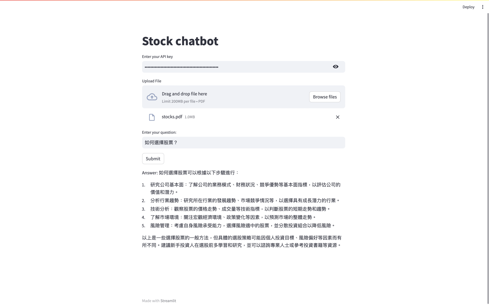

# Stock chatbot

Demo: https://stockchatbot-9qiq42d9phesptr8kjrdxz.streamlit.app/

## 預先準備：
1. OpenAI API key
2. Download (stocks.pdf)[https://www.btcc.com/zh-TW/academy/doc/tw-getting-started-with-stocks.pdf]
 
## 操作：
1. Enter your API key
2. Select your pdf file
3. Enter your question
4. Click Submit button

## 參考：可以丟給bot的問題
- 什麼是權值股？
- 什麼是市場價格總值？
- 如何選擇股票？
- 如何觀察最低實收資本額？